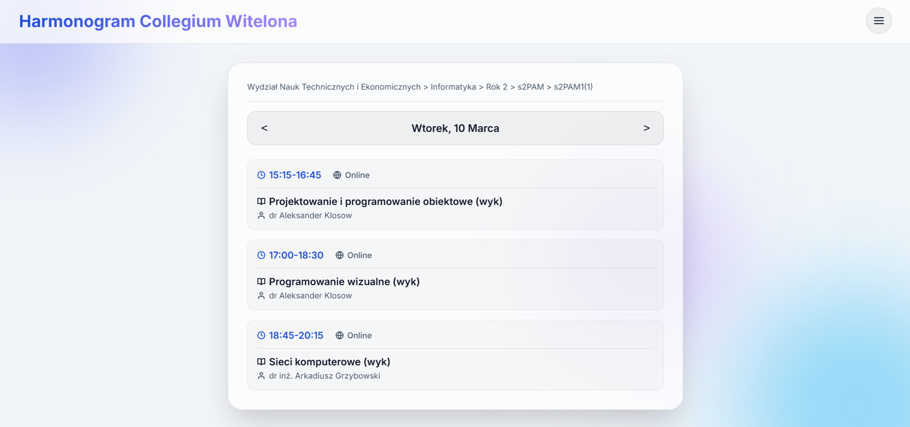

# Web app description:

Unofficial, alternative web app for viewing Collegium Witelona's class schedule. Work in progress, don't rely on it.

# User interface:


# Running the project:

https://plan-cw.pages.dev/

Alternatively: Open index.html in your browser of choice.

To scrape for a new schedule, run python script:

```bash
python scraper.py 
```

You can use these flags after `scraper.py` to narrow the scope of scraping.

Python script downloads list_faculties.json every time, then it does the files for the selected filters. 

You can also use multiple filters simultaneously.

1. `--all` (default)

   Download all available schedules.

   Example: python scraper.py --all

2. `--faculty "[Nazwa Wydziału]"`

   Download schedules for a specific faculty.

   Example: python scraper.py --faculty "Wydział Nauk Technicznych i Ekonomicznych"

3. `--specialization "[Nazwa Kierunku]"`

   Download schedules for a specific specialization.

   Example: python scraper.py --specialization "Informatyka"

4. `--year [Year]`

   Download schedules for a specific year.

   Example: python scraper.py --year 2

5. `--code [Group Code]`

   Download schedules for a specific group.

   Example: python scraper.py --code s2PAM

6. `--subgroup [Subgroup Code]`

   Download schedules for a specific subgroup.

   Example: python scraper.py --subgroup s2PAM1(1)
